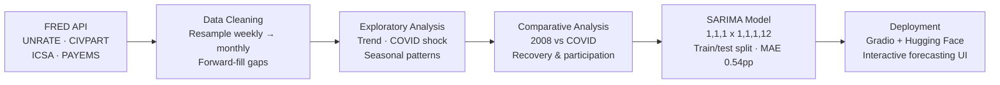
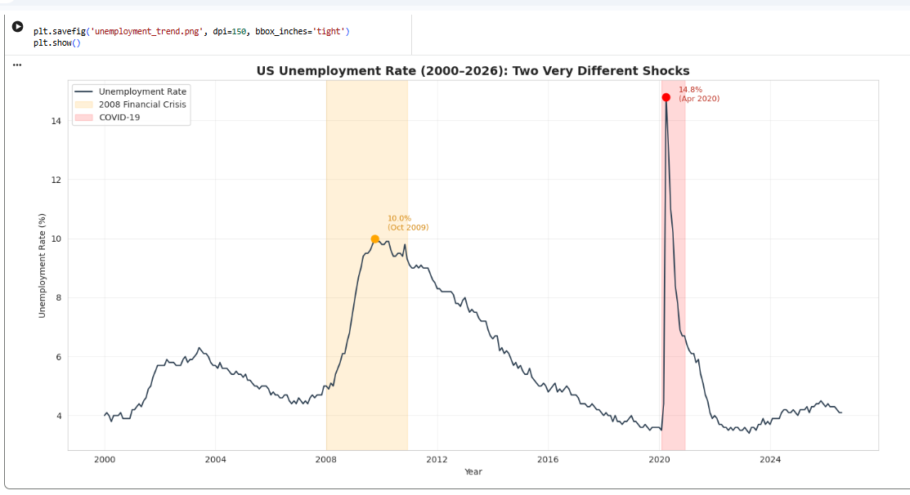
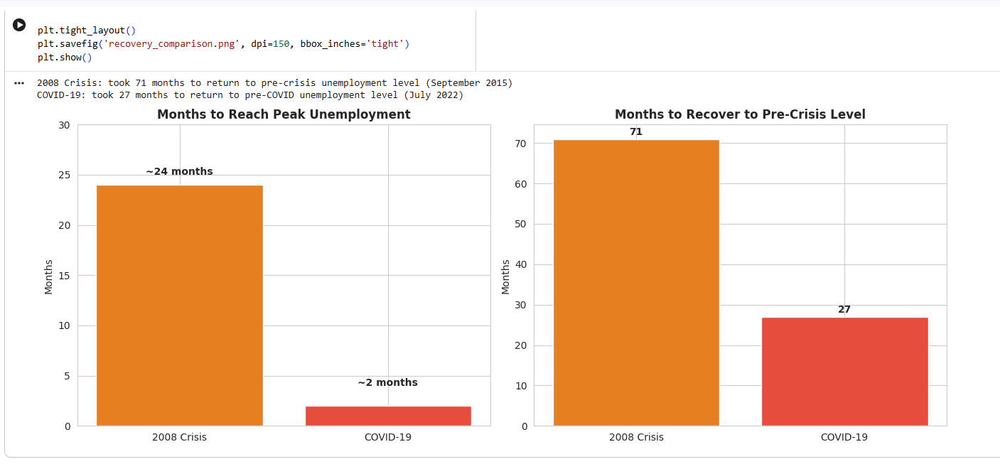
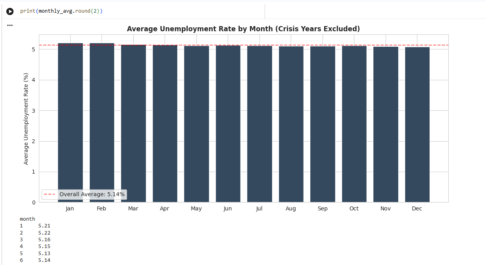
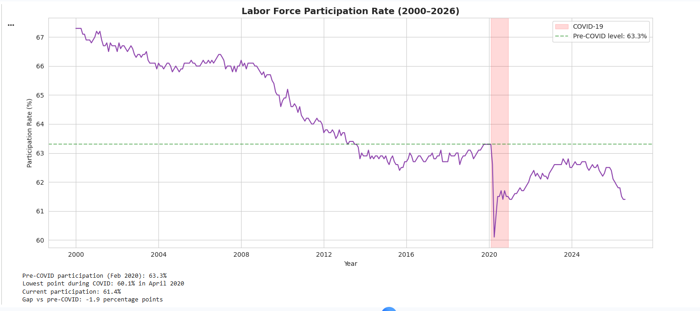
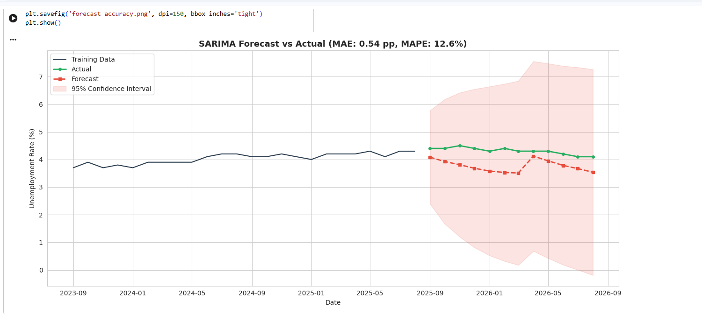
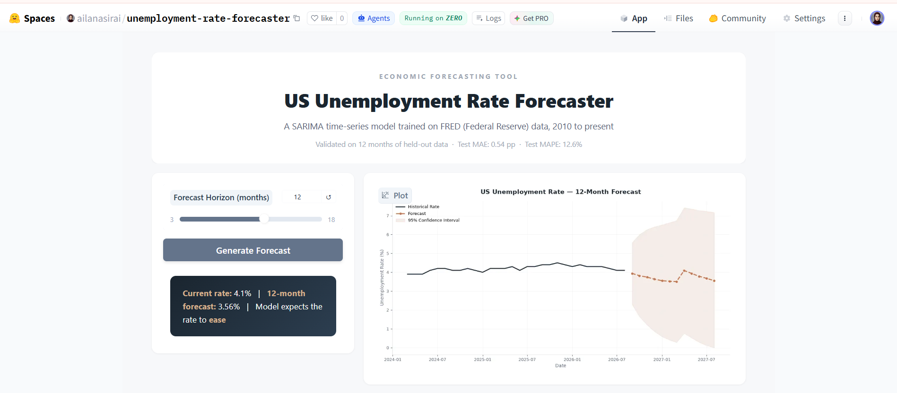

# US Unemployment Analysis & Forecasting

### What if the unemployment rate is lying to you?

A single number can't tell you how *fast* a crisis hit, how *long* recovery took, or whether people quietly gave up looking for work altogether. This project pulls apart 26 years of official Federal Reserve data to find out — and ends with a live model that forecasts where the rate is headed next.

**🚀 Live app:** [US Unemployment Rate Forecaster →](https://huggingface.co/spaces/ailanasirai/unemployment-rate-forecaster)
**📓 Notebook:** [EXPS_UnemploymentAnalysis.ipynb](./EXPS_UnemploymentAnalysis.ipynb)

---

## The Four Questions This Project Answers

1. **Speed** — How did COVID-19 actually compare to the 2008 financial crisis?
2. **Recovery** — Which crisis was harder to bounce back from?
3. **The hidden number** — Is the labor force quietly shrinking behind a "healthy" unemployment rate?
4. **The future** — Can a statistical model meaningfully forecast where the rate goes next?

---

## Methodology / Pipeline

**Stages in order:**

1. **Ingestion** — Pull four time series live from the FRED API rather than a static file, so the analysis is reproducible and stays current.
2. **Cleaning** — Resample the weekly jobless-claims series to monthly frequency to align it with the other three, then forward-fill a small number of trailing gaps from not-yet-finalized FRED releases.
3. **Exploratory analysis** — Visualize the full 26-year trend, isolate the COVID and 2008 crisis windows, and check for calendar seasonality.
4. **Comparative analysis** — Quantify time-to-peak and time-to-recovery for both crises, and separately track labor force participation to see what the unemployment rate alone misses.
5. **Forecasting** — Fit a seasonal ARIMA model on post-2010 data (excluding the COVID anomaly from training), validate it on a held-out 12-month window, then retrain on the full series for production use.
6. **Deployment** — Package the trained model behind a Gradio interface and deploy it as a public, interactive Hugging Face Space.

---

## Data Source

All data was pulled directly from the [FRED API](https://fred.stlouisfed.org/) (Federal Reserve Bank of St. Louis) — the same source economists and policy analysts use professionally, not a static Kaggle download.

| Series | What it measures |
|---|---|
| `UNRATE` | Civilian unemployment rate (monthly, seasonally adjusted) |
| `CIVPART` | Labor force participation rate |
| `ICSA` | Initial jobless claims (weekly, resampled to monthly) |
| `PAYEMS` | Total nonfarm payroll employment |

---

## 1. Two Minutes vs. Two Years — The Speed Gap

**The question:** A number alone doesn't show *how fast* a shock hit — and speed is what decides whether policy can move gradually or has to move immediately.

**What I did:** Isolated both crisis windows and measured the time from baseline to peak unemployment.

**What I found:** COVID-19 pushed unemployment from 3.5% to 14.8% in just **2 months**. The 2008 financial crisis took roughly **24 months** to add a smaller 5.5 points. COVID wasn't just a bigger shock — it was a different *kind* of shock entirely, one that left no room for the slower policy response used in 2008.

---

## 2. The Bigger Shock Wasn't the Slower Recovery

**The question:** Does hitting harder mean taking longer to heal? This directly shapes how policy support should be designed.

**What I did:** Measured months from peak unemployment back down to each crisis's pre-crisis baseline.

**What I found:** Despite being far less severe at its peak, the 2008 crisis took **71 months** — nearly 6 years — to fully recover. COVID, despite hitting much harder, recovered in **27 months**. 2008 was a structural crisis that required rebuilding credit and housing markets from scratch; COVID behaved more like an enforced pause that unwound quickly once restrictions lifted.

---

## 3. No, Unemployment Doesn't Care What Month It Is

**The question:** Before crediting "the economy" for anything, rule out the simple explanation — maybe it's just the calendar.

**What I did:** Excluded both crisis windows and averaged unemployment by calendar month across the remaining years.

**What I found:** Monthly averages stayed within a razor-thin **5.09%–5.22%** band. There's no meaningful seasonal effect once crisis years are removed — US unemployment is driven almost entirely by macroeconomic shocks, not the time of year.

---

## 4. The Number That's Been Quietly Hiding the Real Story

**The question:** Unemployment rate only counts people *actively searching*. If people give up and stop looking, they vanish from the number completely — the rate can look "recovered" while the workforce has actually shrunk.

**What I did:** Tracked labor force participation rate separately from the unemployment rate, both through COVID and in the years since.

**What I found:** Participation dropped from 63.3% to a low of 60.1% during COVID and, years later, **still sits about 1.9 percentage points below its pre-COVID level**. Part of this is a structural decline that was already underway since 2000 — but COVID clearly accelerated it. A low unemployment rate can coexist with a shrinking workforce. This is the single most important chart in this project.

---

## 5. Teaching a Model to See Around the Corner

**The question:** Descriptive analysis explains the past. Can the underlying trend and seasonality actually support a genuine forward-looking forecast?

**What I did:** Built a **SARIMA(1,1,1)(1,1,1,12)** time-series model trained on data from 2010 onward (deliberately excluding the COVID anomaly from the training signal), then validated it on 12 months of data the model never saw during training.

**What I found:** The model landed a **Test MAE of 0.54 percentage points** and **Test MAPE of 12.6%** on completely unseen data — a tight margin for a macroeconomic series this volatile. The validated model was then retrained on the full dataset and shipped into production.

---

## Try It Yourself — Live Forecasting Dashboard

The final SARIMA model runs live behind a Gradio interface on Hugging Face Spaces. Pick a forecast horizon from 3 to 18 months and instantly get the projected unemployment rate, a 95% confidence interval, and a month-by-month breakdown — no code required.

**👉 [Launch the live app](https://huggingface.co/spaces/ailanasirai/unemployment-rate-forecaster)**

---

## So What Should Policy Actually Do With This?

- **Build automatic stabilizers, not slow legislation.** COVID's 2-month collapse left zero time for gradual response — triggers that fire automatically beat policies that need a new vote every time.
- **Give structural crises structural timelines.** 2008-style recoveries take years, not quarters (71 months vs. 27) — front-loaded stimulus alone won't cut it.
- **Watch participation, not just unemployment.** It captures the discouraged workers the headline number completely misses.

---

## Tech Stack

`Python` · `pandas` · `NumPy` · `statsmodels` (SARIMA) · `scikit-learn` (evaluation metrics) · `Matplotlib` / `Seaborn` · `Gradio` · `FRED API` · Deployed on `Hugging Face Spaces`

---

## Repository Structure

EXPS_UnemploymentAnalysis/

│

├── EXPS_UnemploymentAnalysis.ipynb Full analysis notebook

├── unemployment_trend.png Chart: 26-year trend, both crises

├── recovery_comparison.png Chart: 2008 vs COVID recovery speed

├── seasonal_pattern.png Chart: monthly seasonality check

├── participation_trend.png Chart: labor force participation

├── forecast_accuracy.png Chart: SARIMA validation results

├── gradio_dashboard.png Screenshot: deployed live app

├── LICENSE

└── README.md

---

## Author

**Aila Nasir**

- 🔗 [LinkedIn](https://linkedin.com/in/ailanasirai)
- 💻 [GitHub](https://github.com/ailanasirai)
- 🤗 [Hugging Face](https://huggingface.co/ailanasirai)
