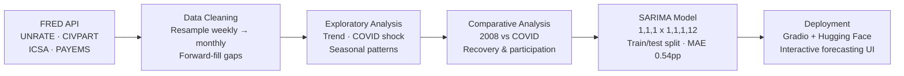

# US Unemployment Analysis & Forecasting

An end-to-end analysis of the US labor market from 2000 to 2026, built on official Federal Reserve (FRED) data. This project investigates how the COVID-19 shock compares to the 2008 financial crisis, tracks a structural shift in labor force participation, and closes with a deployed SARIMA forecasting model that projects unemployment 3–18 months ahead.

**Live app:** [US Unemployment Rate Forecaster →](https://huggingface.co/spaces/ailanasirai/unemployment-rate-forecaster)
**Notebook:** [EXPS_UnemploymentAnalysis.ipynb](./EXPS_UnemploymentAnalysis.ipynb)

---

## Why This Project

Unemployment rate is one of the most quoted economic numbers, but on its own it hides more than it reveals. A single percentage doesn't say how fast a shock hit, how long recovery took, or whether people simply stopped looking for work. This project pulls apart the headline number using real Federal Reserve data to answer four concrete questions:

1. How did COVID-19 actually compare to the 2008 financial crisis, in speed and severity?
2. Which crisis was harder to recover from?
3. Is the labor force actually shrinking, and does the unemployment rate hide that?
4. Can a statistical model meaningfully forecast where the rate is headed next?

---

## Methodology / Pipeline

**Stages in order:**

1. **Ingestion** — Pull four time series live from the FRED API rather than a static file, so the analysis is reproducible and stays current.
2. **Cleaning** — Resample the weekly jobless-claims series to monthly frequency to align it with the other three, then forward-fill a small number of trailing gaps from not-yet-finalized FRED releases.
3. **Exploratory analysis** — Visualize the full 26-year trend, isolate the COVID and 2008 crisis windows, and check for calendar seasonality.
4. **Comparative analysis** — Quantify time-to-peak and time-to-recovery for both crises, and separately track labor force participation to see what the unemployment rate alone misses.
5. **Forecasting** — Fit a seasonal ARIMA model on post-2010 data (excluding the COVID anomaly from training), validate it on a held-out 12-month window, then retrain on the full series for production use.
6. **Deployment** — Package the trained model behind a Gradio interface and deploy it as a public, interactive Hugging Face Space.

---

## Data Source

All data was pulled directly from the [FRED API](https://fred.stlouisfed.org/) (Federal Reserve Bank of St. Louis), the same source economists and policy analysts use professionally.

| Series | What it measures |
|---|---|
| `UNRATE` | Civilian unemployment rate (monthly, seasonally adjusted) |
| `CIVPART` | Labor force participation rate |
| `ICSA` | Initial jobless claims (weekly, resampled to monthly) |
| `PAYEMS` | Total nonfarm payroll employment |

---

## Problem → Approach → Insight

### 1. How fast did COVID-19 hit, compared to 2008?

**Problem:** Unemployment numbers alone don't communicate the speed of a shock, and speed is what determines whether policy can respond gradually or has to move immediately.

**Approach:** Isolated both crisis windows and measured the time from baseline to peak unemployment.

**Insight:** COVID-19 pushed unemployment from 3.5% to 14.8% in just **2 months**. The 2008 financial crisis took roughly **24 months** to add a smaller 5.5 points. COVID wasn't just a bigger shock, it was a fundamentally different *kind* of shock, one that required emergency-speed policy response rather than the more gradual measures used in 2008.

---

### 2. Which crisis was actually harder to recover from?

**Problem:** A shock's peak severity doesn't necessarily predict how long the economy takes to heal. This matters directly for policy design — a fast, deep shock and a slow, grinding one need different kinds of support.

**Approach:** Measured months from peak unemployment back down to each crisis's pre-crisis baseline.

**Insight:** Despite being far less severe at its peak, the 2008 crisis took **71 months** (nearly 6 years) to fully recover. COVID, despite hitting far harder, recovered in **27 months**. This suggests 2008 was a structural crisis requiring the economy to rebuild credit and housing markets from the ground up, while COVID behaved more like an enforced pause that unwound quickly once restrictions lifted.

---

### 3. Does unemployment follow a seasonal pattern?

**Problem:** Before drawing conclusions about "the economy," it's worth ruling out a simpler explanation: maybe unemployment just moves with the calendar.

**Approach:** Excluded both crisis windows and averaged unemployment by calendar month across the remaining years.

**Insight:** Monthly averages stayed within a narrow **5.09%–5.22%** band. There is no meaningful seasonal effect once crisis years are removed — unemployment in the US is driven almost entirely by macroeconomic shocks, not the time of year.

---

### 4. Is the labor market's recovery as complete as the unemployment rate suggests?

**Problem:** Unemployment rate only counts people actively searching for work. If people give up searching, they vanish from the number entirely — the rate can look "recovered" while the workforce has actually shrunk.

**Approach:** Tracked labor force participation rate separately from the unemployment rate, both through COVID and in the years since.

**Insight:** Participation dropped from 63.3% to a low of 60.1% during COVID and, even years later, remains about **1.9 percentage points below its pre-COVID level**. Part of this reflects a structural decline already underway since 2000, but COVID clearly accelerated it. A low unemployment rate can coexist with a shrinking workforce — participation rate deserves equal billing as a headline economic indicator.

---

### 5. Can unemployment be forecast with any real accuracy?

**Problem:** Descriptive analysis explains the past. The more useful question for planning is whether the underlying trend and seasonality in this data can support a genuine forward-looking forecast.

**Approach:** Built a **SARIMA(1,1,1)(1,1,1,12)** time-series model trained on data from 2010 onward (excluding the COVID anomaly from the training signal), then validated it on 12 months of data the model never saw during training.

**Insight:** The model achieved a **Test MAE of 0.54 percentage points** and **Test MAPE of 12.6%** on unseen data — a tight margin for a macroeconomic series this volatile. The validated model was then retrained on the full dataset and deployed as an interactive forecasting tool.

---

## Interactive Forecasting Tool

The final SARIMA model is deployed as a live Gradio application on Hugging Face Spaces. Users select a forecast horizon (3–18 months) and instantly see the projected unemployment rate, a 95% confidence interval, and a month-by-month breakdown.

**Try it live:** [huggingface.co/spaces/ailanasirai/unemployment-rate-forecaster](https://huggingface.co/spaces/ailanasirai/unemployment-rate-forecaster)

---

## Key Takeaways for Policy

- **Fast-moving shocks need automatic stabilizers.** COVID's 2-month collapse left no time for gradual legislative response — policies that trigger automatically outperform ones that require new legislation each time.
- **Structural crises need sustained, multi-year support**, not front-loaded stimulus, given how much longer they take to resolve (71 months vs. 27).
- **Labor force participation should be tracked as a headline indicator alongside unemployment rate**, since it captures discouraged workers the unemployment rate misses entirely.

---

## Tech Stack

`Python` · `pandas` · `NumPy` · `statsmodels` (SARIMA) · `scikit-learn` (evaluation metrics) · `Matplotlib` / `Seaborn` · `Gradio` · `FRED API` · Deployed on `Hugging Face Spaces`

---

## Repository Structure

EXPS_UnemploymentAnalysis/
│
├── EXPS_UnemploymentAnalysis.ipynb Full analysis notebook
├── images/ Charts referenced in this README
├── LICENSE
└── README.md

---

## Author

**Aila Nasir**

- 🔗 [LinkedIn](https://linkedin.com/in/ailanasirai)
- 💻 [GitHub](https://github.com/ailanasirai)
- 🤗 [Hugging Face](https://huggingface.co/ailanasirai)
